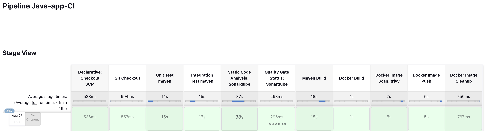
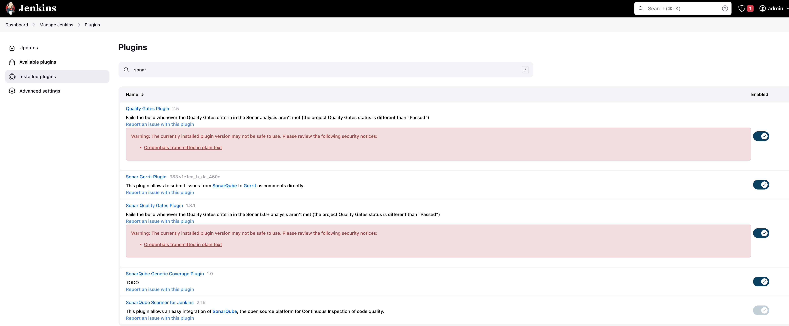
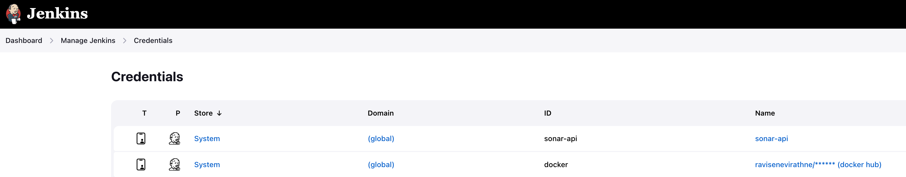
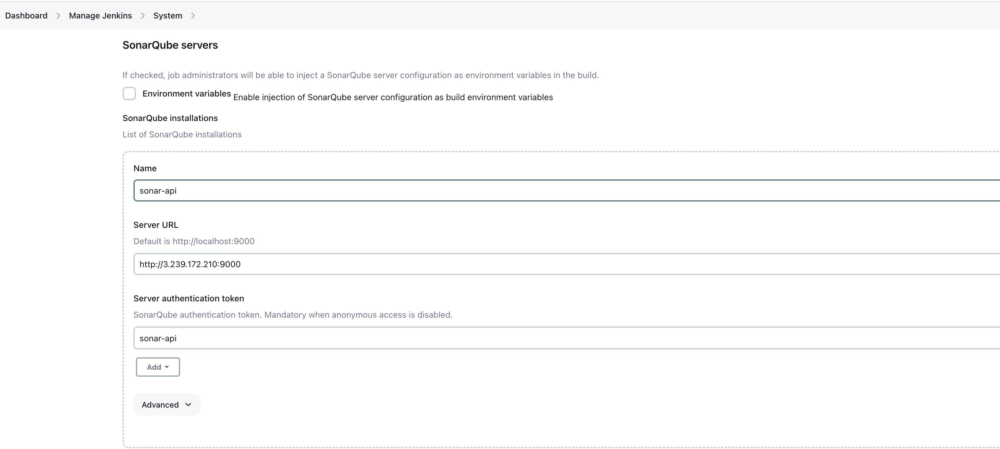
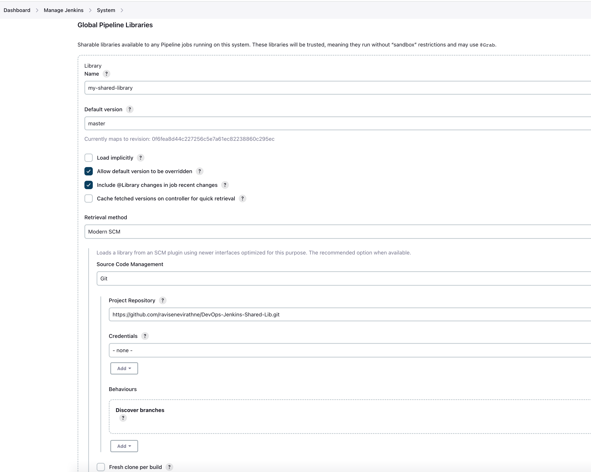
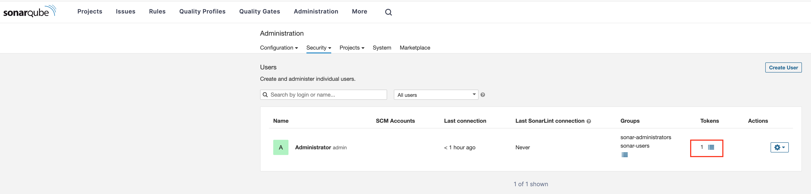
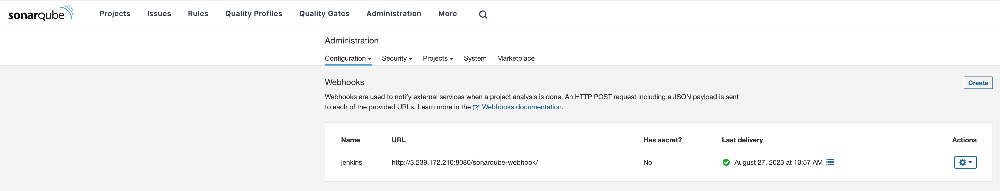

# DevOps CICD Jenkins Pipeline using Jenkins-Shared-Lib with SonarQube and Trivy scanning




### Steps

Create t3.large (2vCPU, 8GB Ram, 30GB HDD) ubuntu vm and install below packages

Jenkins
```
#!/bin/bash
sudo apt update -y
sudo apt upgrade -y 
sudo apt install openjdk-17-jre -y
curl -fsSL https://pkg.jenkins.io/debian-stable/jenkins.io-2023.key | sudo tee \
  /usr/share/keyrings/jenkins-keyring.asc > /dev/null
echo deb [signed-by=/usr/share/keyrings/jenkins-keyring.asc] \
  https://pkg.jenkins.io/debian-stable binary/ | sudo tee \
  /etc/apt/sources.list.d/jenkins.list > /dev/null
sudo apt-get update -y 
sudo apt-get install jenkins -y 
```

Docker 
```
#!/bin/bash
sudo apt update -y
sudo apt install apt-transport-https ca-certificates curl software-properties-common -y
curl -fsSL https://download.docker.com/linux/ubuntu/gpg | sudo apt-key add -
sudo add-apt-repository "deb [arch=amd64] https://download.docker.com/linux/ubuntu bionic stable" -y
sudo apt update -y
apt-cache policy docker-ce -y
sudo apt install docker-ce -y
#sudo systemctl status docker
sudo chmod 777 /var/run/docker.sock
```

Maven
```
sudo apt update -y
sudo apt install maven -y
mvn -version
```

SonarQube
```
docker run -d --name sonarqube -p 9000:9000 -p 9092:9092 sonarqube
```

Trivy
```sudo apt-get install wget apt-transport-https gnupg lsb-release
wget -qO - https://aquasecurity.github.io/trivy-repo/deb/public.key | sudo apt-key add -
echo deb https://aquasecurity.github.io/trivy-repo/deb $(lsb_release -sc) main | sudo tee -a /etc/apt/sources.list.d/trivy.list
sudo apt-get update
sudo apt-get install trivy
```

Install these Jenkins Plugins


Set Sonar and DockerHub Credentials


Add SonarQube Server to Jenkins


Setup the Shared Library Repository


On SonarQube (IP:9000) create the token for Jenkins


On SonarQube (IP:9000) create the webhook for Jenkins

